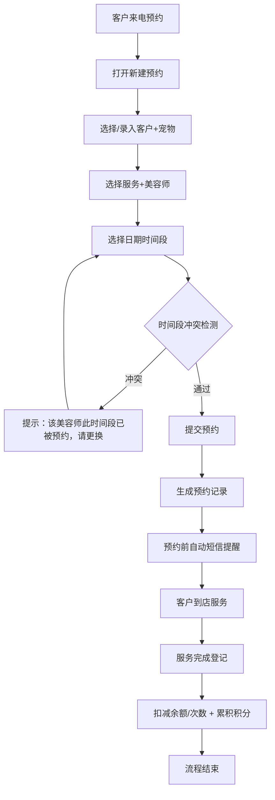

## 1. 产品概述

专为小型宠物美容店打造的一站式管理工具，解决预约冲突、会员积分、服务记录、统计报表等核心业务痛点。帮助店主摆脱纸质记录，实现数字化高效运营。

- 核心目标：简化预约流程、规范会员管理、提升服务体验、提供数据决策
- 目标用户：宠物美容店店主及美容师

## 2. 核心功能

### 2.1 用户角色

| 角色 | 注册方式 | 核心权限 |
|------|----------|----------|
| 店主/管理员 | 系统预置账号 | 全部功能权限，含规则设置、数据统计 |
| 美容师 | 管理员创建 | 预约查看、服务完成登记 |

### 2.2 功能模块

1. **仪表盘**：今日预约概览、本月关键数据、快捷操作入口
2. **预约管理**：预约日历、新建预约、预约冲突检测、预约状态管理、短信提醒
3. **会员管理**：会员档案、宠物档案、会员卡充值、积分管理、充值规则设置
4. **服务项目**：服务类型管理、价格设置、服务套餐配置
5. **历史记录**：宠物服务档案查询、消费记录、积分变动记录
6. **统计报表**：月度充值统计、服务量统计、热门服务排名、美容师业绩

### 2.3 页面详情

| 页面名称 | 模块名称 | 功能描述 |
|-----------|-------------|---------------------|
| 仪表盘 | 数据概览卡 | 今日预约数、待服务数、本月充值额、本月服务数 |
| 仪表盘 | 快捷入口 | 新建预约、新增会员、充值、服务完成登记 |
| 仪表盘 | 今日时间线 | 按时间展示今日所有预约及状态 |
| 预约管理 | 日历视图 | 月/周/日视图切换，色块区分预约状态 |
| 预约管理 | 新建预约表单 | 客户信息、宠物信息、选择服务、选择美容师、时间段选择 |
| 预约管理 | 冲突检测 | 同一美容师同时间段自动拦截，提示冲突 |
| 预约管理 | 预约详情 | 查看/编辑/取消预约，状态流转（待确认-已确认-服务中-已完成-已取消） |
| 会员管理 | 会员列表 | 搜索筛选，会员卡片展示余额、积分、宠物数 |
| 会员管理 | 会员详情 | 基本信息、宠物列表、充值记录、消费记录、积分明细 |
| 会员管理 | 会员充值 | 选择充值档位、赠送服务次数自动计算、支付方式记录 |
| 会员管理 | 充值规则设置 | 可配置充X元送Y次某服务，支持多档位 |
| 服务项目 | 服务列表 | 服务名称、时长、价格、是否参与积分兑换 |
| 积分中心 | 积分兑换 | 选择兑换项（服务/商品）、扣减积分、生成兑换记录 |
| 宠物档案 | 服务历史 | 按时间倒序展示每次服务内容、套餐、美容师、备注 |
| 统计报表 | 月度充值 | 柱状图展示每日充值额，汇总总额 |
| 统计报表 | 服务统计 | 本月服务总数、各服务类型占比饼图 |
| 统计报表 | 热门排行 | TOP10最受欢迎服务项目、TOP5美容师业绩 |

## 3. 核心流程

### 3.1 预约流程
客户来电 → 店主打开新建预约 → 输入/选择客户和宠物 → 选择服务项目和美容师 → 选择日期时间（系统自动校验冲突）→ 提交预约 → 系统生成预约记录 → 预约时间前N小时自动发送短信提醒 → 客户到店 → 服务中 → 服务完成 → 扣减余额/次数 + 累积积分

### 3.2 会员充值流程
会员到店充值 → 打开会员详情 → 点击充值 → 选择充值档位（自动显示赠送内容）→ 确认支付 → 增加余额/赠送次数 → 生成充值记录

### 3.3 积分兑换流程
会员查询积分 → 打开积分兑换 → 选择兑换项（服务/宠物零食）→ 确认兑换 → 扣减积分 → 生成兑换记录/消费券

## 4. 用户界面设计

### 4.1 设计风格
- **主色调**：温暖的奶油米色（#FDF6EC）作为底色，柔和的鼠尾草绿（#8B9D83）作为主色，搭配陶土橙（#D97757）作为强调色
- **辅助色**：淡粉（#F2D7D5）用于预约提醒，浅蓝（#A8C5DA）用于数据可视化
- **按钮风格**：圆角胶囊型，主色填充带微妙阴影，hover时轻微上浮+颜色加深
- **字体**：标题用「思源黑体CN Bold」圆润有力，正文用「思源黑体CN Regular」清晰易读，数字用等宽字体提升数据可读性
- **布局风格**：左侧固定导航栏 + 右侧内容区，卡片式模块设计，大量留白营造透气感
- **图标风格**：轻量线性图标（Lucide风格），配以柔和的彩色圆形背景点缀
- **装饰元素**：点缀爪印🐾、骨头🦴等宠物相关emoji，营造温馨友好氛围

### 4.2 页面设计概述

| 页面名称 | 模块名称 | UI元素 |
|-----------|-------------|----------|
| 仪表盘 | 数据概览卡 | 渐变背景卡片+大数字+上升/下降箭头微标，进入时从下往上错位渐入 |
| 仪表盘 | 今日时间线 | 竖线时间轴，左侧时间戳+右侧事件卡，状态色标签 |
| 预约管理 | 日历视图 | 大格子日历，日期角标显示预约数量，色块标注不同状态，hover时浮动预览卡 |
| 预约管理 | 新建表单 | 分步式表单（客户→服务→时间→确认），步骤指示条，左侧时间网格可视化可选时段 |
| 会员管理 | 会员卡片 | 头像圆形+会员等级徽章，右侧三个关键数字（余额/积分/宠物），悬停轻微放大 |
| 会员管理 | 充值弹窗 | 档位卡片横向排列，选中态带高亮边框和"最受欢迎"标签，金额数字带动效 |
| 统计报表 | 图表区 | 圆角容器+柔和阴影，图表配色与主题统一，hover显示详细数据tip |

### 4.3 响应式
- **桌面端**：左侧导航固定240px，内容区全宽展示，日历默认月视图
- **平板端**：导航折叠为图标模式，内容区自适应，日历周视图
- **移动端**：底部Tab导航，卡片列表单列，日历日视图优先
- **触摸优化**：按钮最小44px触控区，滑动切换日历视图，下拉刷新数据

### 4.4 动效设计
- 页面切换：内容区淡入+轻微右滑（150ms）
- 卡片交互：hover时 translateY(-2px) + 阴影加深
- 按钮点击：scale(0.97) 回弹效果
- 数据更新：数字滚动变化动画
- 预约冲突：红色边框抖动+渐入提示文字
