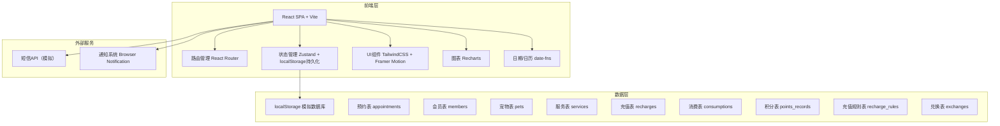
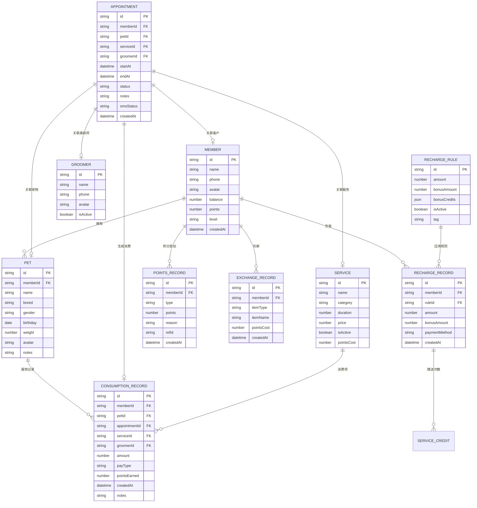

## 1. 架构设计



## 2. 技术描述

- **前端框架**：React@18 + TypeScript
- **构建工具**：Vite@5
- **样式方案**：TailwindCSS@3 + 自定义主题配置
- **状态管理**：Zustand（轻量、支持中间件持久化到localStorage）
- **路由**：React Router DOM@6
- **UI组件库**：自定义封装（避免臃肿，保持设计独特性）+ lucide-react 图标
- **动画效果**：Framer Motion（页面切换、卡片交互、微动效）
- **数据可视化**：Recharts（轻量级React图表库，支持自定义样式）
- **日期处理**：date-fns（轻量、不可变、模块化）
- **表单处理**：React Hook Form + Zod 校验
- **后端**：无纯前端实现，使用 localStorage 持久化模拟数据库
- **数据初始化**：首次加载预置Mock数据（会员、宠物、服务、充值规则等）

## 3. 路由定义

| Route | 页面名称 | 说明 |
|-------|----------|------|
| / | 仪表盘 | 今日预约概览 + 关键数据 + 快捷入口 |
| /appointments | 预约管理 | 日历视图 + 预约列表 + 新建/编辑预约 |
| /appointments/new | 新建预约 | 分步式预约表单 |
| /appointments/:id | 预约详情 | 预约信息 + 状态操作 |
| /members | 会员列表 | 会员卡片网格 + 搜索筛选 |
| /members/:id | 会员详情 | 基本信息 + 宠物 + 充值/消费/积分记录 |
| /members/:id/recharge | 会员充值 | 充值档位选择弹窗 |
| /points | 积分中心 | 积分兑换 + 兑换记录 |
| /services | 服务项目 | 服务管理CRUD |
| /settings | 规则设置 | 充值规则 + 提醒设置 |
| /reports | 统计报表 | 月度充值/服务/排行图表 |

## 4. API定义（无后端，采用Store层封装）

### 4.1 Store模块划分

```typescript
// 预约相关
interface AppointmentStore {
  appointments: Appointment[];
  createAppointment(data: CreateAppointmentDTO): { success: boolean; conflict?: Appointment };
  updateAppointment(id: string, data: Partial<Appointment>): void;
  cancelAppointment(id: string, reason: string): void;
  checkConflict(groomerId: string, startAt: Date, endAt: Date, excludeId?: string): Appointment | null;
  getAppointmentsByDate(date: Date): Appointment[];
  getAppointmentsByRange(start: Date, end: Date): Appointment[];
  completeAppointment(id: string): { success: boolean; error?: string };
}

// 会员相关
interface MemberStore {
  members: Member[];
  createMember(data: CreateMemberDTO): Member;
  updateMember(id: string, data: Partial<Member>): void;
  recharge(id: string, ruleId: string, amount: number, paymentMethod: string): RechargeRecord;
  deductBalance(id: string, amount: number): boolean;
  deductServiceCredits(id: string, serviceId: string, count: number): boolean;
  addPoints(id: string, points: number, reason: string): void;
  deductPoints(id: string, points: number, reason: string): boolean;
}

// 宠物相关
interface PetStore {
  pets: Pet[];
  createPet(data: CreatePetDTO): Pet;
  updatePet(id: string, data: Partial<Pet>): void;
  getPetsByMember(memberId: string): Pet[];
  getPetServiceHistory(petId: string): ConsumptionRecord[];
}

// 服务相关
interface ServiceStore {
  services: Service[];
  groomers: Groomer[];
  createService(data: CreateServiceDTO): Service;
  updateService(id: string, data: Partial<Service>): void;
}

// 充值规则相关
interface RechargeRuleStore {
  rules: RechargeRule[];
  createRule(data: CreateRechargeRuleDTO): RechargeRule;
  updateRule(id: string, data: Partial<RechargeRule>): void;
  deleteRule(id: string): void;
  applyRule(rule: RechargeRule): { amount: number; credits: { serviceId: string; count: number }[] };
}

// 统计相关
interface ReportStore {
  getMonthlyRechargeStats(year: number, month: number): DailyStat[];
  getMonthlyServiceStats(year: number, month: number): ServiceStat[];
  getTopServices(year: number, month: number, limit: number): RankedItem[];
  getTopGroomers(year: number, month: number, limit: number): RankedItem[];
  getSummary(year: number, month: number): MonthlySummary;
}
```

## 5. 数据模型

### 5.1 ER图



### 5.2 核心数据类型定义

```typescript
// 预约状态
type AppointmentStatus = 'pending' | 'confirmed' | 'in_service' | 'completed' | 'cancelled';

// 预约
interface Appointment {
  id: string;
  memberId: string;
  petId: string;
  serviceId: string;
  groomerId: string;
  startAt: string; // ISO string
  endAt: string;
  status: AppointmentStatus;
  notes?: string;
  smsStatus: 'pending' | 'sent' | 'failed' | 'disabled';
  createdAt: string;
}

// 会员
interface Member {
  id: string;
  name: string;
  phone: string;
  avatar?: string;
  balance: number;
  points: number;
  level: '普通' | '银卡' | '金卡' | '钻石';
  serviceCredits: { serviceId: string; count: number }[];
  createdAt: string;
}

// 宠物
interface Pet {
  id: string;
  memberId: string;
  name: string;
  breed: string;
  gender: '公' | '母';
  birthday?: string;
  weight?: number;
  avatar?: string;
  notes?: string;
}

// 服务项目
interface Service {
  id: string;
  name: string;
  category: '基础洗护' | '造型修剪' | 'SPA护理' | '其他';
  duration: number; // 分钟
  price: number;
  isActive: boolean;
  pointsCost?: number; // 积分兑换所需
}

// 美容师
interface Groomer {
  id: string;
  name: string;
  phone: string;
  avatar?: string;
  isActive: boolean;
}

// 充值规则
interface RechargeRule {
  id: string;
  amount: number;
  bonusAmount: number;
  bonusCredits: { serviceId: string; count: number; serviceName?: string }[];
  isActive: boolean;
  tag?: string;
}

// 充值记录
interface RechargeRecord {
  id: string;
  memberId: string;
  ruleId?: string;
  amount: number;
  bonusAmount: number;
  paymentMethod: '现金' | '微信' | '支付宝' | '刷卡';
  createdAt: string;
}

// 消费记录
interface ConsumptionRecord {
  id: string;
  memberId: string;
  petId: string;
  appointmentId?: string;
  serviceId: string;
  groomerId?: string;
  amount: number;
  payType: 'balance' | 'credit' | 'cash' | 'wechat' | 'alipay';
  pointsEarned: number;
  createdAt: string;
  notes?: string;
}

// 积分记录
interface PointsRecord {
  id: string;
  memberId: string;
  type: 'earn' | 'spend';
  points: number;
  reason: string;
  refId?: string;
  createdAt: string;
}

// 兑换记录
interface ExchangeRecord {
  id: string;
  memberId: string;
  itemType: 'service' | 'product';
  itemName: string;
  itemId?: string;
  pointsCost: number;
  createdAt: string;
}
```

### 5.3 初始化Mock数据

首次加载时注入以下Mock数据以便体验完整功能：

- **美容师**：小美、阿杰、Lily 共3人
- **服务项目**：基础洗澡、精致洗澡、泰迪造型、比熊造型、金毛洗护、SPA护理、药浴护理 共7项
- **充值规则**：充300送1次洗澡、充500送3次洗澡+100余额、充1000送800余额+5次造型
- **会员**：张女士（带泰迪"豆豆"）、李先生（带金毛"大黄"）、王小姐（带比熊"棉花糖"）
- **预约**：未来7天若干已排预约（覆盖不同状态、美容师）
- **历史数据**：过去30天充值记录、消费记录、积分变动
